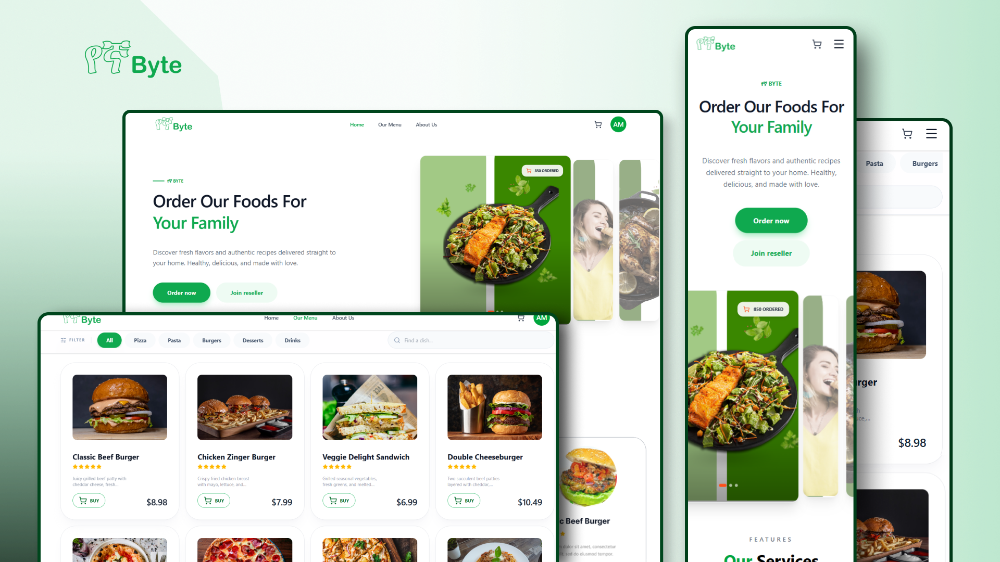

# Food Delivery Website

A modern **Food Delivery Platform** where users can browse menus, add items to a cart, place orders, and securely pay online using Stripe.

### Live Preview
Check out the live website:  
[View Live Website](https://yegnabyte.vercel.app)

---

## Project Overview

The Food Delivery Website enables users to order food and drinks online with ease. It features a smooth user experience, responsive design for both mobile and desktop, and secure payment integration using Stripe.  

This project demonstrates my skills in **full-stack development, payment integration, and responsive web design**.

---

## Features

- Browse food and drink menus with categories  
- Add items to a shopping cart and update quantities  
- Place orders online with a secure checkout  
- Stripe payment integration for fast and safe payments  
- Order history and tracking for users  
- Responsive design for mobile and desktop  

---

## Technologies Used

- React.js  
- Node.js  
- Express.js  
- MongoDB  
- Stripe API  
- Tailwind CSS  

---

## Purpose of the Project

This project was built to:  

- Showcase full-stack web development skills  
- Implement secure payment processing with Stripe  
- Practice responsive UI/UX design for modern applications  
- Build a real-world project suitable for portfolio demonstration  

---

